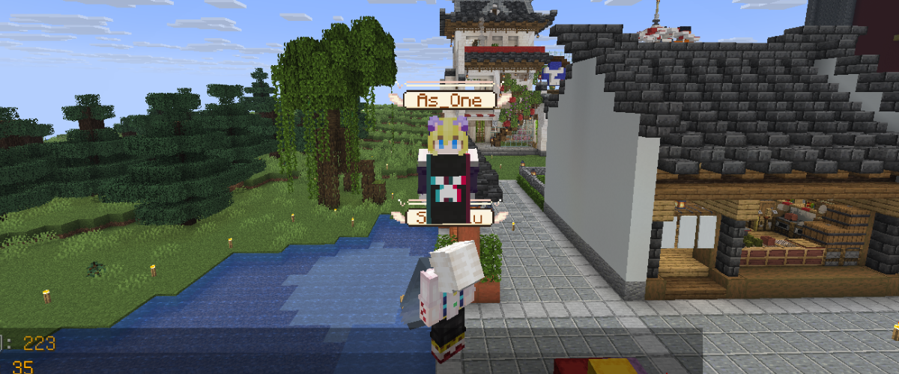
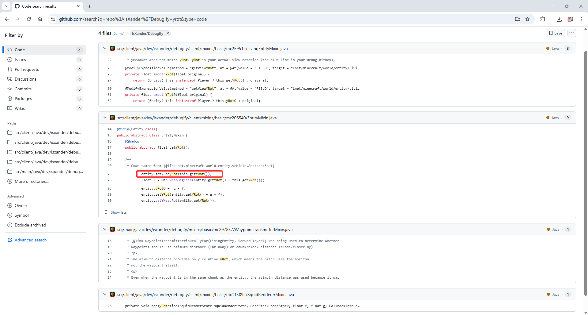

## 问题现象

在一个 **安装了 Gsit 插件的服务器** 中，当玩家坐在另一名玩家头上时，会出现一个不符合预期的现象：

- 坐在其他玩家头上的玩家，**身体不会随头部旋转**

从视觉效果上看，就是“头在转，身体却像被锁住了一样”，与原版预期行为明显不一致。

> 📷 

---

## 初步判断与思路

这个问题的特殊之处在于：

- 服务端使用的是 **Gsit 插件**
- 客户端同时安装了 **多个模组**

结合以往模组开发经验，我知道**服务端无法直接强制指定玩家身体的旋转方向**。因此在看到这个现象时，我首先怀疑：

> 是否有某个客户端模组修改了实体的旋转或渲染逻辑？

基于这一判断，我决定优先从 **客户端模组冲突** 的角度进行排查。

---

## 使用二分法定位问题模组

在模组数量较多的情况下，我采用了一个高效的方法 —— **二分法排查**：

1. 先禁用一半模组，测试问题是否仍然存在
2. 根据结果继续对“有问题的那一半”进行拆分
3. 重复上述过程，直到定位到具体模组

经过多轮测试，最终可以稳定复现并确认：

> **问题由客户端模组 Debugify 导致**

当 Debugify 存在时问题必现；完全移除 Debugify 后，问题消失。

---

## 深入 Debugify 源码分析

确认问题来自 Debugify 后，下一步是搞清楚它具体修改了哪些内容。

我直接访问了 Debugify 的 GitHub 仓库，并围绕实体旋转相关字段进行搜索，例如：

- `yaw`
- `yRot`
- `rotation`

很快定位到一个高度相关的修复文件：  
`Debugify/src/client/java/dev/isxander/debugify/client/mixins/basic/mc206540/EntityMixin.java`

> 📷 

---

## 验证：关闭修复项

为了确认问题确实由该修复项引起，我进行了针对性测试：

- 保留 Debugify 模组
- **仅关闭 `mc206540` 这一修复项**

测试结果符合预期：

- 玩家坐在他人头上时
- 身体可以正常随头部旋转

至此可以确认，**问题的直接原因正是 Debugify 中的 `mc206540` 修复项**。

---

## 结论与解决方案

### 问题原因

- Debugify 的 `mc206540` 修复修改了实体旋转行为
- 在特定场景下影响了玩家的朝向表现
- 与 Gsit 插件产生了行为上的不兼容

### 解决方案

- 保留 Debugify 模组
- 关闭 `mc206540` 修复项

这一方案是折中的处理方式，既保留了 Debugify 的其他功能，又恢复了正常的游戏表现。

---

## 一点经验总结

- 插件出现异常表现，有时是插件与客户端模组冲突引起的
- 二分法在模组排查中非常高效，尤其适合模组数量较多的情况
- 对开源模组，可以通过源码仓库快速定位关键修改

---

## 关于 AI 辅助写作的说明

本文中的问题排查、测试过程、源码定位及结论均来自我个人的实际实践。  
AI 仅用于整理和优化文字表达，以提升可读性，未参与实际问题排查与解决。
